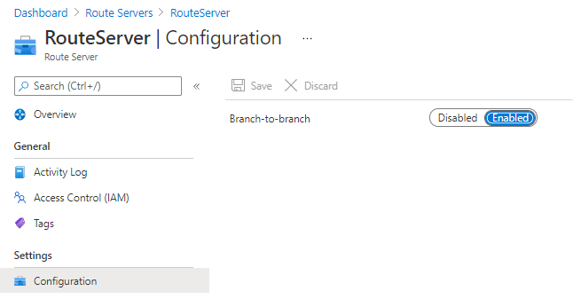
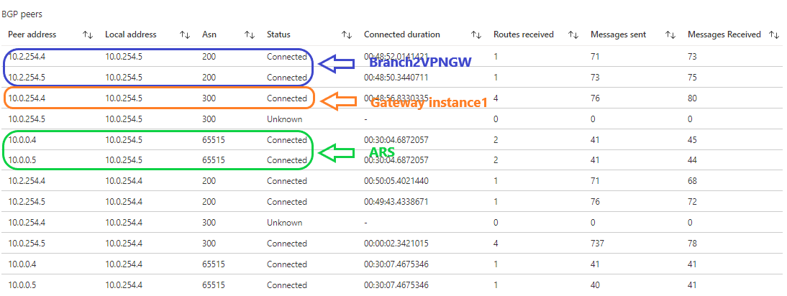
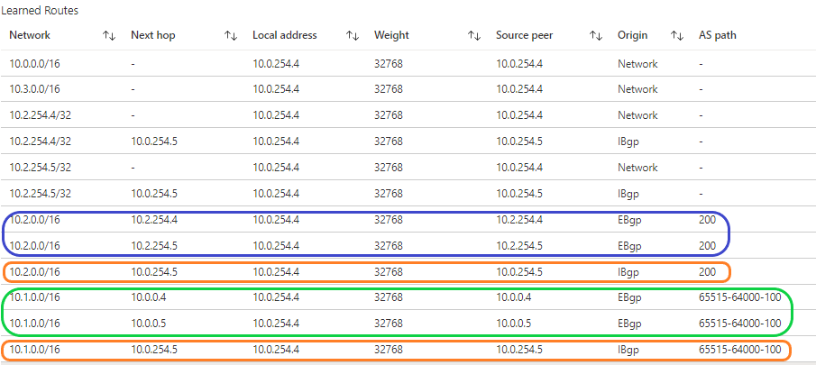
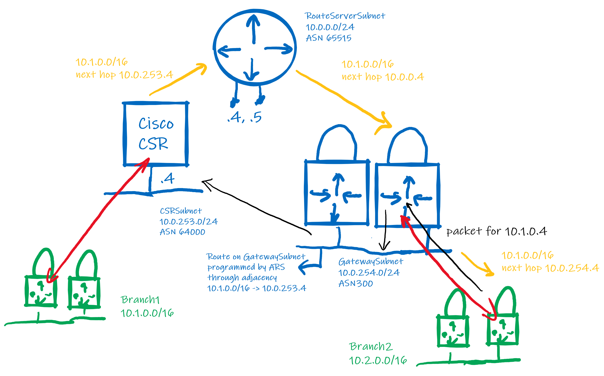
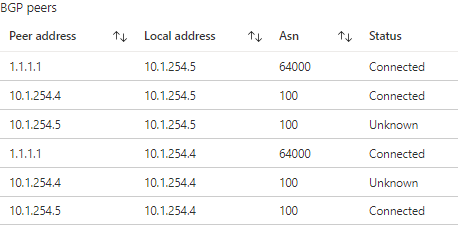
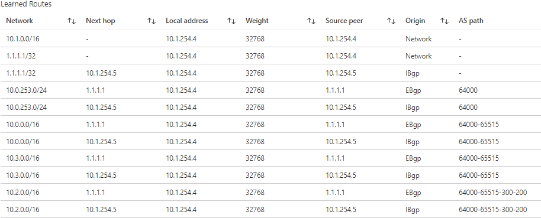
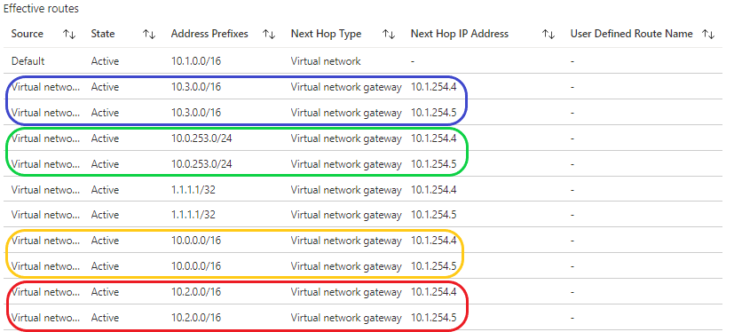

# **Azure Route Server with Cisco CSR8000v NVA**

# Introduction
This lab demonstrates one of the use cases of [Azure Route Server](https://docs.microsoft.com/en-us/azure/route-server/overview): BGP route exchange with a Network Virtual Appliance and a VPN Gateway.

The lab consists of:
- A Hub VNET containing ARS, a Cisco CSR8000v NVA, a VPN Gateway and a VM
- Branch VNETs, each containing a VPN Gateway and a VM
- BGP-enabled VPN connections from the Branches to the CSR and the Hub Gateway respectively
- A Spoke VNET containing a VM, peered to the Hub. 

The lab is built in Bicep and leverages the CSR8000v free-trial Marketplace offer. 


# Deploy
Log in to Azure Cloud Shell at https://shell.azure.com/ and select Bash.

Ensure Azure CLI and extensions are up to date:
  
      az upgrade --yes
  
If necessary select your target subscription:
  
      az account set --subscription <Name or ID of subscription>
  
Clone the  GitHub repository:
  
      git clone https://github.com/mddazure/azure-route-server-lab
  
Change directory:
  
      cd ./azure-route-server-lab

Accept the terms for the CSR8000v Marketplace offer:

      az vm image terms accept -p cisco -f cisco-c8000v-byol --plan 17_13_01a-byol -o none

Deploy the Bicep template:

      az deployment sub create --location westeurope --template-file templates/main.bicep

Verify that all components in the diagram above have been deployed to the resourcegroup `ars-lab` and are healthy. 

The S2S VPN tunnel between the VPN Gateways in Hub and Spoke2 is present and already connected. 

Credentials:

username: `AzureAdmin`

password: `Routeserver-2021`

tunnel pre-shared key: `Routeserver2021`

# Configure
The BGP peering between ARS and the VPN Gateway in the Hub is controlled by the Branch-to-branch switch; in the portal this is under RouteServer - Configuration. The lab deploys ARS with this switch enabled and no further configuration is needed.



The CSR8000v NVA is up but it must still be configured:

- Obtain both public IP addresses of Branch1VPNGW in Cloud Shell:

      az network public-ip show -g ars-lab -n Branch1VPNGWPubIpV41 --query 'ipAddress'
      az network public-ip show -g ars-lab -n Branch1VPNGWPubIpV42 --query 'ipAddress'

- In below configuration, replace *Branch1VPNGWPubIpV41* and *Branch1VPNGWPubIpV42* with the first and second public IP addresses of Branch1VPNGW.

- Log in to the CSR8000v, preferably via the Serial console in the portal as this does not rely on network connectivity in the VNET. 
  - Serial console is under Support + troubleshooting in the Virtual Machine blade.

- Enter Enable mode by typing `en` at the prompt, then enter Configuration mode by typing `conf t`.

      license boot level network-advantage addon dna-advantage
      do wr mem
      do reload

- The NVA will now reboot. When rebooting is complete log on again through Serial Console.

- Type `en` and then `conf t`.

- Paste in below configuration, one block at a time:

```
crypto ikev2 proposal azure-proposal-connectionS1HubCSR 
 encryption aes-cbc-256 aes-cbc-128
 integrity sha1 sha256
 group 2
!
crypto ikev2 policy azure-policy-connectionS1HubCSR 
 proposal azure-proposal-connectionS1HubCSR
!
crypto ikev2 keyring azure-keyring
 peer Branch1VPNGWPubIpV41
  address Branch1VPNGWPubIpV41
  pre-shared-key Routeserver2021
 peer Branch1VPNGWPubIpV42
  address Branch1VPNGWPubIpV42
  pre-shared-key Routeserver2021
!
crypto ikev2 profile azure-profile-connectionB1HubCSR
 match address local interface GigabitEthernet1
 match identity remote address Branch1VPNGWPubIpV41 255.255.255.255 
 match identity remote address Branch1VPNGWPubIpV42 255.255.255.255 
 authentication remote pre-share
 authentication local pre-share
 keyring local azure-keyring
 lifetime 28800
 dpd 10 5 on-demand
!
crypto ipsec transform-set azure-ipsec-proposal-set esp-aes 256 esp-sha256-hmac 
 mode tunnel
!
crypto ipsec profile azure-ipsec-b1
 set security-association lifetime kilobytes 102400000
 set transform-set azure-ipsec-proposal-set 
 set ikev2-profile azure-profile-connectionB1HubCSR
!
interface Tunnel101
 ip address 10.0.100.4 255.255.255.254
 ip tcp adjust-mss 1350
 tunnel source GigabitEthernet1
 tunnel mode ipsec ipv4
 tunnel destination Branch1VPNGWPubIpV41
 tunnel protection ipsec profile azure-ipsec-b1
!
interface Tunnel102
 ip address 10.0.100.6 255.255.255.254
 ip tcp adjust-mss 1350
 tunnel source GigabitEthernet1
 tunnel mode ipsec ipv4
 tunnel destination Branch1VPNGWPubIpV42
 tunnel protection ipsec profile azure-ipsec-b1
!
interface Loopback11
 ip address 1.1.1.1 255.255.255.255
!
! default route pointing to CSR subnet default gateway, so that tunnel outside traffic and internet go out LAN port
ip route 0.0.0.0 0.0.0.0 GigabitEthernet1 10.0.253.1
! static routes for Branch1 GatewaySubnet pointing to Tunnel101 and Tunnel102, so that Branch1GW BGP peer address is reachable
ip route 10.1.254.4 255.255.255.255 Tunnel101
ip route 10.1.254.5 255.255.255.255 Tunnel102
! static route to ARS subnet pointing to CSR subnet default gateway, to prevent recursive routing failure for ARS endpoint addresses learned via BGP from ARS
ip route 10.0.0.0 255.255.255.0 10.0.253.1
!
router bgp 64000
 bgp log-neighbor-changes
! network statement so that directly connected subnet is advertised to Branch1
 network 10.0.253.0 mask 255.255.255.0
 neighbor 10.0.0.4 remote-as 65515
 neighbor 10.0.0.4 ebgp-multihop 255
 neighbor 10.0.0.5 remote-as 65515
 neighbor 10.0.0.5 ebgp-multihop 255
 neighbor 10.1.254.4 remote-as 100
 neighbor 10.1.254.4 ebgp-multihop 255
 neighbor 10.1.254.4 update-source Loopback11
 neighbor 10.1.254.5 remote-as 100
 neighbor 10.1.254.5 ebgp-multihop 255
 neighbor 10.1.254.5 update-source Loopback11

```
- Type `exit` multiple times, until the prompt shows `csr#`.

# Observe

**From HubVPNGW**

In the portal, navigate to Virtual network gateways -> Branch1VPNGW. Under Monitoring, click BGP Peers.

***BGP Peers***

The VPN Gateway in the Hub has a BGP peering with ARS. This is controlled by the ARS Branch-to-branch switch turned on during lab deployment.

:point_right: Both instances of the Gateway have EBgp peers with Branch2VPNGW at Asn 200 over the VPN, blue in the table below, and with ARS at Asn 65515, green. 

Note the IBgp peer between instances at Asn 300, orange, which is the Asn of this Gateway.



 ***Learned Routes***

HubVPNGW learns the routes for Branch2, blue in the route table below, from Branch2VPNGW. The route exchange with the other Gateway instance is in the orange boxes.

The route for Branch1, `10.1.0.0/16` in the green box, is learned from ARS. Branch1 is behind CRS at `10.0.253.4`, but the interface addresses of ARS, `10.0.0.4` and `10.0.0.5`, are listed as the next hops for `10.1.0.0/16`. 


The table shows entries for one Gateway instance, entries for the other instance are similar.

:point_right: ARS is not a router and is not in the data path. HubVPNGW sees ARS's interfaces as the next hops to Branch1 so will send any traffic  for Branch1 out of its LAN interface, onto the GatewaySubnet. ARS has programmed a route for Branch1 on the GatewaySubnet (on the host running the Gateway instance really), pointing to CSR at `10.0.253.4`. This sends traffic leaving HubVPNGW for Branch1 directly to CSR. 



This is similar to how ARS programs Spoke1VM with the route for Branch1 pointing to CRS, described below, which can be observed through Effective Routes on the VM NIC. Unfortunately, Effective Routes for Gateway instances cannot be inspected.

:point_right: Both instances of the active-active Gateway have a full set of routes. They also learn routes from each other, marked Origin IBgp. These routes are less prefered than those learned via EBgp and are only used when an instance looses the direct path to a destination, for example when a tunnel connection drops.


**From CSR**

Log in to CSR via Serial Console.

Type `show ip int brief` .

 :thumbsup: Verify status of interfaces Tunnel101 and Tunnel102 shows `up` for both Interface and Line Protocol.
  
Obtain the BGP table by typing `show ip bgp`. The table returned should be as shown below.

:point_right: Routes with a Next Hop of `10.0.0.4` and `10.0.0.5` and AS `65515` in the Path are received from Azure Route Server. Routes with a Next Hop of `10.1.254.4` and `10.1.254.5` and AS `100` are received from Branch1VPNGW via the VPN tunnels. 


:point_right: Note that the entry for `10.2.0.0/16`, the prefix of Branch 2, has a Path of `65515` (ARS), `300` (HubVPNGW), `200` (Branch2VPNGW).
```
BGP table version is 6, local router ID is 1.1.1.1
Status codes: s suppressed, d damped, h history, * valid, > best, i - internal,
              r RIB-failure, S Stale, m multipath, b backup-path, f RT-Filter,
              x best-external, a additional-path, c RIB-compressed,
              t secondary path, L long-lived-stale,
Origin codes: i - IGP, e - EGP, ? - incomplete
RPKI validation codes: V valid, I invalid, N Not found

     Network          Next Hop            Metric LocPrf Weight Path
 *    10.0.0.0/16      10.0.0.5                               0 65515 i
 *>                    10.0.0.4                               0 65515 i
 *>   10.0.253.0/24    0.0.0.0                  0         32768 i
 *>   10.1.0.0/16      10.1.254.4                             0 100 i
 *                     10.1.254.5                             0 100 i
 *    10.2.0.0/16      10.0.0.5                               0 65515 300 200 i
 *>                    10.0.0.4                               0 65515 300 200 i
 *    10.3.0.0/16      10.0.0.5                               0 65515 i
 *>                    10.0.0.4                               0 65515 i
```
Type `show ip route` to obtain the routing table.

The routes preceded by a `B` are sourced from BGP. 

:point_right: Note that only the routes marked with `>`, meaning "best", in the BGP table above have been copied into the routing table. 

Because the lab is built with active-active gateways and VPN connections, and ARS is active-active too, BGP learns two routes for each destination. Only one route is selected and placed in the routing table, as determined by the [BGP Best Path Selection Algorithm](https://www.cisco.com/c/en/us/support/docs/ip/border-gateway-protocol-bgp/13753-25.html).  
```Codes: L - local, C - connected, S - static, R - RIP, M - mobile, B - BGP
       D - EIGRP, EX - EIGRP external, O - OSPF, IA - OSPF inter area
       N1 - OSPF NSSA external type 1, N2 - OSPF NSSA external type 2
       E1 - OSPF external type 1, E2 - OSPF external type 2, m - OMP
       n - NAT, Ni - NAT inside, No - NAT outside, Nd - NAT DIA
       i - IS-IS, su - IS-IS summary, L1 - IS-IS level-1, L2 - IS-IS level-2
       ia - IS-IS inter area, * - candidate default, U - per-user static route
       H - NHRP, G - NHRP registered, g - NHRP registration summary
       o - ODR, P - periodic downloaded static route, l - LISP
       a - application route
       + - replicated route, % - next hop override, p - overrides from PfR

Gateway of last resort is 10.0.253.1 to network 0.0.0.0

S*    0.0.0.0/0 [1/0] via 10.0.253.1, GigabitEthernet1
                [1/0] via 10.0.253.1
      1.0.0.0/32 is subnetted, 1 subnets
C        1.1.1.1 is directly connected, Loopback11
      10.0.0.0/8 is variably subnetted, 13 subnets, 4 masks
B        10.0.0.0/16 [20/0] via 10.0.0.4, 00:14:35
S        10.0.0.0/24 [1/0] via 10.0.253.1
C        10.0.100.4/31 is directly connected, Tunnel101
L        10.0.100.4/32 is directly connected, Tunnel101
C        10.0.100.6/31 is directly connected, Tunnel102
L        10.0.100.6/32 is directly connected, Tunnel102
C        10.0.253.0/24 is directly connected, GigabitEthernet1
L        10.0.253.4/32 is directly connected, GigabitEthernet1
B        10.1.0.0/16 [20/0] via 10.1.254.4, 00:14:35
S        10.1.254.4/32 is directly connected, Tunnel101
S        10.1.254.5/32 is directly connected, Tunnel102
B        10.2.0.0/16 [20/0] via 10.0.0.4, 00:14:35
B        10.3.0.0/16 [20/0] via 10.0.0.4, 00:14:35
      168.63.0.0/32 is subnetted, 1 subnets
S        168.63.129.16 [254/0] via 10.0.253.1
      169.254.0.0/32 is subnetted, 1 subnets
S        169.254.169.254 [254/0] via 10.0.253.1
```
Ping Branch1VM, Branch2VM and Spoke1VM from CSR by typing `ping 10.1.0.4`, `ping 10.2.0.4`, `ping 10.3.0.4`. Verify that the pings succeed.


**From Spoke1VM**

Log on to Spoke1VM via Bastion.

Open a command prompt and type `curl 10.1.0.4` to connect to Branch1VM. The response should read "Branch1VM". Type `tracert 10.1.0.4`. The first hop reported is `10.0.253.4`, the LAN interface of CSR. Note that Branch1VPNGW, the hop after CSR, does *not* show in the traceroute.

Do the same for Branch2VM at `10.2.0.4`. HubVPNGW and Branch2VPNGW do not show in the tracert output.

In the portal, navigate to Network interfaces -> Spoke1VM-nic. Click Effective routes.

:point_right: Note that the route for the prefix of Branch1, `10.1.0.0/16`, points to `10.0.253.4`. This is the LAN interface of the CSR Network Virtual Appliance.

Traffic from Spoke1VM for Branch1 is directed to the CSR, where it is sent through the tunnel. This route was learned by ARS from the CSR via BGP. Then ARS programmed the route in the NIC route table. 

:exclamation: This is the purpose of ARS: without it, the Azure platform would not know that `10.1.0.0/16` is behind the CSR. The only solution without ARS is static routing: manually attached a User Defined Route to the subnet - as we have always done it :wink:!

 **From Branch1VPNGW**

In the portal navigate to Virtual network gateways -> Branch1VPNGW. Under Monitoring, click BGP Peers.

***BGP Peers***

Both instances of the VPN GW have a BGP peering and exchange routes with CSR over the VPN tunnels.



The peer with address `1.1.1.1` is the CSR. This is the address of the loopback interface on the CSR used to source the BGP sessions. A static route set in the Local Network Gateway tells Branch1VPNGW that this address is on the other side of the tunnel.

 ***Learned Routes***
Branch1VPNGW learns the routes for Hub and Branch2 prefixes from CSR, and CSR's AS of 64000 is in the path of these routes.



:point_right: In the entry for `10.2.0.0/16` note the AS Path is 64000 (CSR), 65515 (ASR), 300 (HubVPNGW), 200 (Spoke1VPNGW). CSR learns the route for `10.2.0.0/16` from ASR via BGP; static routing on the CSR is not required. 

:exclamation: Without ASR, the CSR (or any other NVA) would not be able to dynamically learn routes from the Azure platform, and it would have to have static routes configured.

:point_right: Observe the peerings between both instances of the active-active Gateway with addresses `10.1.254.4` and `10.1.254.5`.
Each instance learns routes both via EBgp from CSR via the tunnel, and via IBgp from the other instance. Normally, the EBgp routes are prefered and the IBgp routes will be ingnored. However, if an instance's tunnel drops, the IBGP route serves as the backup to the other instance which will still have an operational tunnel.

If a packet for `10.3.0.4` (Spoke1VM) arrives at an instance, the instance will normally send it out through its tunnel. If the tunnel is no longer present, the instance will send the packet to the other instance via the IBgp route. The other instance will then be able to deliver the packet via its tunnel connection.

**From Branch1VM**

Navigate to Network interfaces -> Branch1VM-nic. Click Effective routes. 


The VM has routes for all prefixes outside of the VNET, pointing to both instances of the Gateway.


:point_right: The Azure platform will do Equal Cost Multipath (ECMP) routing, meaning that traffic will be shared over both Gateway instances. Traffic is load shared by flow, with a flow identified by its "5-tuple" of source and destination IP addresses, source and destination ports and protocol (TCP, UDP, ICMP).

Packets belonging to the same flow are sent to the same next hop (Gateway instance). Flow symmetry is not guaranteed: the path for return packets of the same flow is independently determined by the CSR. Return traffic may be sent via the tunnel to the other Gateway instance.


