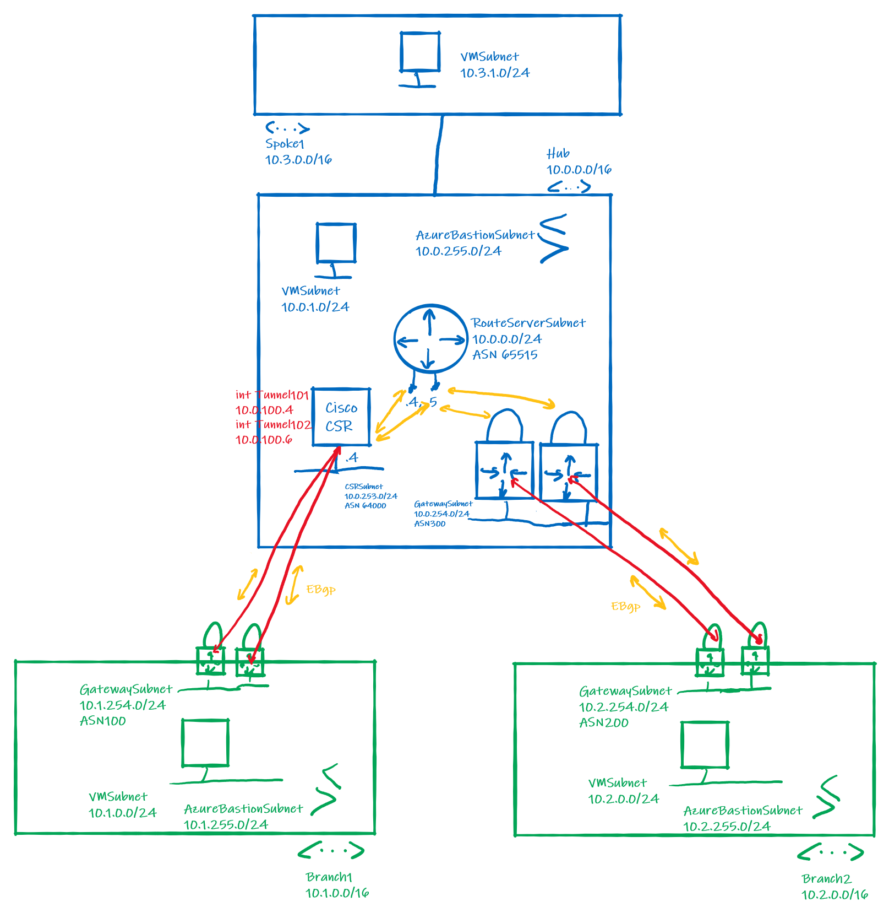

# **Azure Route Server with Cisco CSR1000v NVA**

# Introduction
The objective of this lab is to demonstrate and experiment with route exchange between an NVA and the Azure routing plane through Azure Route Server (ARS).

The lab consists of a hub VNET containing ARS, a Cisco CSR1000v NVA a VPN Gateway and a VM, and two spoke VNETs each containing a VPN Gateway and a VM. Spoke 2 has a S2S  VPN connection to the hub Gateway, the Gateway in spoke 1 has a VPN connection to the CSR. The VPN connections are BGP-enabled.

The lab is built in Bicep. It leverages the CSR1000v free-trial Marketplace offer.



# Deploy
Log in to Azure Cloud Shell at https://shell.azure.com/ and select Bash.

Ensure Azure CLI and extensions are up to date:
  
`az upgrade --yes`
  
If necessary select your target subscription:
  
`az account set --subscription <Name or ID of subscription>`
  
Clone the  GitHub repository:
  
`git clone https://github.com/mddazure/azure-route-server-lab`
  
Change directory:
  
`cd ./azure-route-server-lab`

Create a Resource Group:

`az group create --name ars-lab --location westeurope`

Accept the terms for the CSR1000v Marketplace offer:

`az vm image terms accept --urn cisco:cisco-csr-1000v:16_12_5-byol:latest`

Deploy the Bicep template:

`az deployment group create --resource-group ars-lab --template-file rs.bicep`

Verify that all components in the diagram above have been deployed and are healthy. 

Credentials:
username: `AzureAdmin`
password: `Routeserver-2021`
tunnel pre-shared key: `Routeserver2021`

The S2S VPN tunnel between the gateways in Hub and Spoke2 is present and connected. 

# Configure
The CSR1000v NVA is up but must still be configured.

First obtain the public IP address of Spoke1VPNGW from the portal.

Log in to the CSR1000v, preferably via the Serial Console in the portal as this does not rely on network connectivity in the VNET.

Enter Enable mode by typing `en` at the prompt, then enter Configuration mode by typing `conf t`.

Paste in following configuration, replacing *Branch1VPNGWPubIpV41* and *Branch1VPNGWPubIpV42* with the first and second public IP addresses of Branch1VPNGW:

```
crypto ikev2 proposal azure-proposal-connectionS1HubCSR 
 encryption aes-cbc-256 aes-cbc-128
 integrity sha1 sha256
 group 2
!
crypto ikev2 policy azure-policy-connectionS1HubCSR 
 proposal azure-proposal-connectionS1HubCSR
!
crypto ikev2 keyring azure-keyring
 peer <Branch1VPNGWPubIpV41>
  address <Branch1VPNGWPubIpV41>
  pre-shared-key Routeserver2021
 peer <Branch1VPNGWPubIpV42>
  address <Branch1VPNGWPubIpV42>
  pre-shared-key Routeserver2021
!
crypto ikev2 profile azure-profile-connectionB1HubCSR
 match address local interface GigabitEthernet1
 match identity remote address <Branch1VPNGWPubIpV41> 255.255.255.255 
 match identity remote address <Branch1VPNGWPubIpV42> 255.255.255.255 
 authentication remote pre-share
 authentication local pre-share
 keyring local azure-keyring
 lifetime 28800
 dpd 10 5 on-demand
!
crypto ipsec transform-set azure-ipsec-proposal-set esp-aes 256 esp-sha256-hmac 
 mode tunnel
!
crypto ipsec profile azure-ipsec-b1
 set security-association lifetime kilobytes 102400000
 set transform-set azure-ipsec-proposal-set 
 set ikev2-profile azure-profile-connectionB1HubCSR
!
interface Tunnel101
 ip address 10.0.100.4 255.255.255.254
 ip tcp adjust-mss 1350
 tunnel source GigabitEthernet1
 tunnel mode ipsec ipv4
 tunnel destination <Branch1VPNGWPubIpV41>
 tunnel protection ipsec profile azure-ipsec-b1
!
interface Tunnel102
 ip address 10.0.100.6 255.255.255.254
 ip tcp adjust-mss 1350
 tunnel source GigabitEthernet1
 tunnel mode ipsec ipv4
 tunnel destination <Branch1VPNGWPubIpV42>
 tunnel protection ipsec profile azure-ipsec-b1
!
interface Loopback11
 ip address 1.1.1.1 255.255.255.255
!
router bgp 64000
 bgp log-neighbor-changes
! network statement so that directly connected subnet is advertised to Branch1
 network 10.0.253.0 mask 255.255.255.0
 neighbor 10.0.0.4 remote-as 65515
 neighbor 10.0.0.4 ebgp-multihop 255
 neighbor 10.0.0.5 remote-as 65515
 neighbor 10.0.0.5 ebgp-multihop 255
 neighbor 10.1.254.4 remote-as 100
 neighbor 10.1.254.4 ebgp-multihop 255
 neighbor 10.1.254.4 update-source Loopback11
 neighbor 10.1.254.5 remote-as 100
 neighbor 10.1.254.5 ebgp-multihop 255
 neighbor 10.1.254.5 update-source Loopback11
!
! default route pointing to CSR subnet default gateway, so that tunnel outside traffic and internet go out LAN port
ip route 0.0.0.0 0.0.0.0 GigabitEthernet1 10.0.253.1
! static routes for Branch1 GatewaySubnet pointing to Tunnel101 and Tunnel102, so that Branch1GW BGP peer address is reachable
ip route 10.1.254.4 255.255.255.255 Tunnel101
ip route 10.1.254.5 255.255.255.255 Tunnel102
! static route to ARS subnet pointing to CSR subnet default gateway, to prevent recursive routing failure for ARS endpoint addresses learned via BGP from ARS
ip route 10.0.0.0 255.255.255.0 10.0.253.1
```
Type `exit` multiple times, until the prompt shows `en#`.

# Verify

**From the CSR**
- Type `show ip int brief` and verify the status of interface Tunnel100 shows `up` for both Interface and Line Protocol.
- Ping Spoke1VM from CSR by typing `ping 10.1.0.4`
- Verify route exchange 


